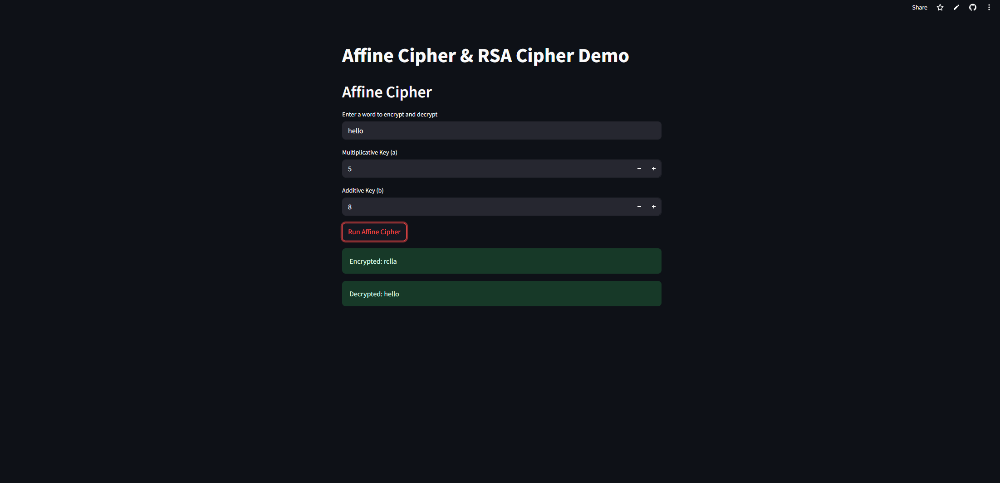
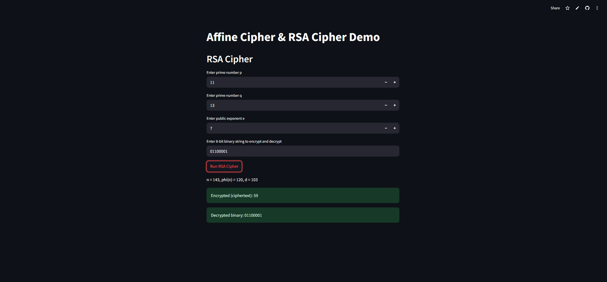

# 🔐 Cryptography Demonstration: Affine Cipher and RSA Cipher

This project is a simple yet effective demonstration of classical and public-key cryptographic techniques implemented in Python with an interactive **Streamlit** user interface.

It covers:

* ✅ **Affine Cipher** – a substitution cipher using linear transformation
* ✅ **RSA Cipher** – an asymmetric encryption algorithm based on number theory

---

## 📌 Features

* Encrypt and decrypt messages using the Affine Cipher.
* Encrypt and decrypt 8-bit binary strings using RSA.
* Immediate visualization of both encrypted and decrypted outputs.
* Streamlit-based interactive UI for demos or educational purposes.

---

## 🧐 Algorithms Overview

### 🚰 Affine Cipher

The Affine Cipher encrypts a letter `x` using:

```
E(x) = (a * x + b) mod 26
```

Decryption is:

```
D(y) = a_inv * (y - b) mod 26
```

Where:

* `a` is the multiplicative key (must be coprime with 26)
* `b` is the additive key
* `a_inv` is the modular inverse of `a` mod 26

**Example**:

```python
cipher = AffineCipher(5, 8)
encrypted = cipher.encrypt("hello")   # Output: "raxxy"
decrypted = cipher.decrypt(encrypted) # Output: "hello"
```

---

### 🔐 RSA Cipher

RSA uses asymmetric keys (public and private). It's based on the difficulty of factoring large integers.

#### Steps:

1. Choose two primes `p` and `q`
2. Compute `n = p * q` and `phi = (p-1)*(q-1)`
3. Choose `e` such that `1 < e < phi` and `gcd(e, phi) = 1`
4. Compute private key `d` as the modular inverse of `e` mod `phi`
5. Encrypt: `c = m^e mod n`
6. Decrypt: `m = c^d mod n`

**Example**:

```python
rsa = RSACipher(11, 13, 7)
encrypted = rsa.encrypt("10101010")   # Output: integer ciphertext
decrypted = rsa.decrypt(encrypted)    # Output: "10101010"
```

---

## 🚀 How to Run the App

### 1. Clone the repository

```bash
git clone https://github.com/your-username/crypto-streamlit-demo.git
cd crypto-streamlit-demo
```

### 2. Install dependencies

```bash
pip install -r requirements.txt
```

Contents of `requirements.txt`:

```
streamlit
```

### 3. Run the Streamlit app

```bash
streamlit run streamlit_app.py
```

---

## 🖼️ Interface Screenshots

| Affine Cipher Demo                                  | RSA Cipher Demo                               |
| --------------------------------------------------- | --------------------------------------------- |
|  |  |

> (You can add these screenshots to a `screenshots/` folder.)

---

## 📁 Project Structure

```
crypto-streamlit-demo/
│
├── affine_cipher.py        # AffineCipher class
├── rsa_cipher.py           # RSACipher class
├── streamlit_app.py        # Streamlit app interface
├── README.md               # This file
└── requirements.txt
```

---

## 🧑‍🏫 Educational Use Case

This app is perfect for:

* Computer science viva demonstrations
* Cryptography labs
* Interactive teaching
* Basic security concept visualizations

---

## ✅ TODO (Optional Improvements)

* Add key validation hints in the UI
* Extend RSA for multi-bit string encryption
* Add support for custom alphabets in Affine Cipher

---

## 🛡️ License

This project is licensed under the MIT License. Feel free to use and modify for educational purposes.
